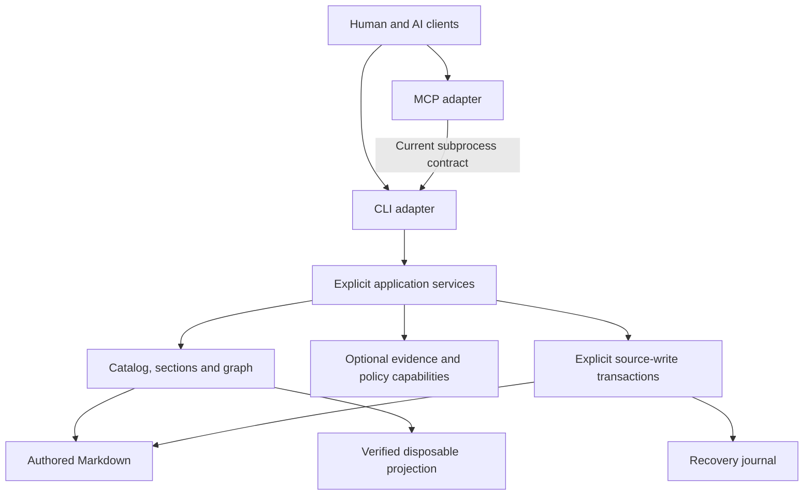

# Documentation Engine architecture review

Date: 2026-09-12
Reviewed package version: 0.5.0
Source baseline: `3f5f9cc42e1ad4da4b9d6b9fd7387e9f3dcc01f4`
Disposition: retain the architecture; strengthen implementation boundaries and persistence contracts before expanding its responsibilities.

## Executive assessment

The architecture is well suited to the project's published purpose: maintaining structured Markdown knowledge that remains accessible to humans and AI clients as a project grows. Stable addresses, explicit graph semantics, inspectable context selection, disposable projections and provider-neutral interfaces form a coherent foundation. The implementation contains substantial evidence that these principles guide behavior, rather than existing only in documentation.

The main weakness is the concentration of application behavior in the CLI. The project has useful domain modules, but the boundary between application services and command presentation is incomplete. Additional concerns are inconsistent write-recovery guarantees, an ambiguity between physical byte identity and normalized text identity, whole-catalog work for small reads, and coupling between otherwise optional capabilities through configuration loading.

This is a strong local documentation engine with growing architectural debt. It is not yet evidence of a scalable concurrent knowledge service. That distinction does not make its current design unsuccessful: the documented trust model, completeness rules and single-writer assumptions deliberately favor correctness and transparent failure. A rewrite, mandatory database or mandatory server is not justified by this review.

The highest-value direction is to preserve the source-of-truth and retrieval model while extracting reusable application services and making durability, identity and execution limits explicit.

## Scope and method

The assessment uses the published goals in [README](README.md), [Architecture](docs/architecture.md), [AI client integration](docs/client-integration.md), [MCP adapter](docs/mcp-adapter.md), and the related public contracts. Exploratory product ideas are not treated as approved requirements or implementation defects. Private planning documents and adopter corpora were not inspected for this review.

The review covered source-module dependencies, representative end-to-end read/context and write paths, configuration loading, projection verification, federation, provider artifacts, representative regression tests, CI and packaging configuration. It is a single-reviewer architectural assessment, not a complete security audit or a line-by-line proof of every operation.

Two isolated diagnostics exercised concrete questions about newline identity and optional configuration. They used a synthetic project in a temporary directory under `/tmp`, which was removed after execution. No project source, configuration, tests or private planning files were modified. This report is the only new repository deliverable. A pre-existing working-tree change to `AGENTS.md` was left untouched.

### Structural observations

An AST-based inventory of `src/docsystem/*.py` and `tests/test_*.py` found:

| Observation | Result | Interpretation |
| --- | ---: | --- |
| Source modules | 32 | A compact package with several distinct capabilities |
| Source lines, including comments and blanks | 25,020 | Scale indicator, not a quality score |
| Lines in `cli.py` | 9,540, or 38.1% of source | Application and presentation responsibilities are concentrated |
| Functions in `cli.py`, including nested definitions | 186 | The CLI is more than argument dispatch |
| Largest CLI functions | Parser: 922 lines; maintenance: 570; context: 363; main: 350 | Parser size alone does not explain the concentration |
| Test modules / test function definitions | 35 / 578 | Definitions are not collected test-case counts or coverage percentages |
| Test modules importing `docsystem.cli` functions | 26 | Much behavior is verified through the CLI-facing seam |
| Explicit intra-package import cycles found by AST inspection | 0 | The module graph has useful dependency discipline |

Dynamic imports and runtime call dependencies are outside the import-cycle observation. Test quantity alone does not establish correctness.

## Fit against the published goals

| Goal | Assessment | Evidence and qualification |
| --- | --- | --- |
| Markdown remains the source of truth | Strong | Catalogs derive from Markdown; stale/corrupt projections visibly fall back. Physical byte identity needs clarification under newline normalization. |
| Complete access with task-sized reads | Strong delivery design | Explicit sections, omissions, outline, known-revision and compact modes preserve inspectability. Small responses do not currently imply small server-side work. |
| Stable identity and explainable relationships | Strong | Document IDs, canonical section anchors, revision pins and distinct authored/observed/generated edges avoid treating every hyperlink as authority. |
| Provider neutrality | Strong | Base dependencies are limited to PyYAML; MCP is optional; the core does not require a model provider or orchestration runtime. |
| Deterministic, verifiable derived state | Strong within stated assumptions | Generation manifests, configuration fingerprints, shard verification and direct/projected parity are explicit mechanisms. |
| Safe adoption and preservation of authored files | Partially satisfied | Scalar-preserving migration and managed-write guards are valuable. Migration rollback does not establish crash-atomic multi-file persistence. |
| Optional advanced capabilities | Partial isolation | Capabilities are separated conceptually and often by module, but one configuration loader validates them all and the CLI imports/composes them together. |
| Sustainable growth in corpus and integrations | Promising, insufficiently demonstrated | Sharding and portable artifacts help. Common reads still materialize the catalog, and the published benchmark measures context bytes rather than latency or memory. |

## Architecture worth preserving

**One semantic implementation behind multiple clients.** The MCP adapter invokes the same CLI that ordinary consumers use, avoiding a second implementation of graph validation and projection fallback. The optional SDK and small base dependency set preserve easy local installation. See [package configuration](pyproject.toml) and [MCP invocation](src/docsystem/mcp_server.py#L30).

**Explicit evidence and omissions.** The graph distinguishes authored metadata, observed links and generated containment. Compact context merges overlapping ranges while retaining the addresses and reasons that requested them. Reverse traversal requires sufficient graph validity to support a complete answer. These choices directly support trustworthy agent context. See [graph model](src/docsystem/graph.py#L1), [compact delivery](src/docsystem/cli.py#L2992), and [context regression tests](tests/test_context_cli.py#L336).

**Verified projections with a usable fallback.** A generation is bound to configuration and derived records, and reads reject unverifiable state. Both serving paths reduce to a shared document view. The tests inspect parity, stale configurations, shard tampering and manifest tampering. See [projection loader](src/docsystem/projection.py#L667) and [parity regression](tests/test_vertical.py#L630). Those tests were inspected, not rerun here.

**Useful domain separation already exists.** Metadata, sections, graph traversal, admission, execution-result validation and lifecycle evaluation have dedicated modules. The journal has no imports from other `docsystem` modules. The absence of explicit import cycles means extraction can be incremental; the project is not an inseparable dependency knot.

**A deliberate external evidence boundary.** Provider artifacts are complete, body-free and independently verifiable. Consumers do not need to understand internal projection shards. Unavailable generations are distinguished from entity absence. See [provider artifacts](docs/provider-artifacts.md) and [artifact regressions](tests/test_provider_artifact.py#L105).

**Verification addresses real operating boundaries.** CI includes Linux tests and lint, lock/build checks, installed CLI consumption, a public adoption walkthrough, and focused Windows UTF-8 tests. See [CI](.github/workflows/ci.yml) and [installed-consumer smoke](scripts/installed_cli_smoke.sh). This review did not inspect a live CI run or claim that these configured checks currently pass.

## Findings, ordered by architectural importance

Priority denotes recommended attention, not a vulnerability severity. High means resolve the boundary before substantial adjacent expansion; medium means address it during the next relevant capability change. Each recommendation remains a proposal.

### AR-01 — Application behavior lives inside the CLI

**Priority: high. Confidence: high. Type: maintainability and integration boundary.**

The CLI owns internal document views, direct/projected adaptation, context selection and packet construction, execution-handoff assembly, maintenance policy checks and transaction coordination. These are application responsibilities as well as command behavior. For example, [`_build_execution_handoff`](src/docsystem/cli.py#L5674) binds admission, mandate snapshots and graph-derived read/review scope, while [`maintenance`](src/docsystem/cli.py#L7227) combines authorization checks and the write workflow. Neither responsibility is intrinsically tied to terminal output.

The module's size is supporting evidence, not the finding by itself. [`_load_views`](src/docsystem/cli.py#L2630) and [`_compact_content_delivery`](src/docsystem/cli.py#L2992) demonstrate that central retrieval abstractions are private CLI implementation details. Many tests appropriately exercise this surface, but another in-process adapter cannot reuse the same behavior through a documented application-service boundary.

**Consequence:** new transports or capabilities must invoke a subprocess, depend on private CLI functions, or duplicate composition logic. Changes to presentation, orchestration and invariants become harder to review independently.

**Recommendation:** incrementally extract application services for context retrieval, evidence assembly and managed maintenance. Return typed results and diagnostics; leave argument validation specific to CLI syntax, exit-code mapping and rendering in the adapter. Keep the CLI/JSON contract stable during extraction. Internal typed services need not immediately become a public Python API.

**Acceptance evidence for future work:** unchanged CLI and MCP contract fixtures, direct/projected output parity, service-level tests without captured stdout, and an import rule preventing application/domain modules from depending on command presentation.

### AR-02 — Migration and managed maintenance have different recovery models

**Priority: high. Confidence: high for the failure boundary. Type: authored-data preservation.**

[`apply_migration_plan`](src/docsystem/migration.py#L255) checks original contents, prepares sibling temporary files, and replaces destinations one at a time. Its rollback keeps original bytes in process memory and runs only when a replacement raises `OSError`. The [rollback test](tests/test_migration.py#L147) exercises a recoverable exception while that process remains alive.

If the process terminates after replacing the first file and before replacing the next, the exception handler cannot run. The result can contain both migrated and unmigrated files, and this path provides no durable migration record from which to reconstruct the transaction. Rollback itself can also fail while writing original bytes. No crash experiment was performed; the boundary follows from the control flow and volatile storage of originals.

The [architecture guide](docs/architecture.md) describes migration with an unqualified claim that a failure never leaves a partially migrated multi-file change. That exceeds what the implementation establishes. Managed maintenance separately uses an [exclusive journal operation](src/docsystem/journal.py#L706) and [persisted before/after data](src/docsystem/journal.py#L777). That is a stronger recovery foundation, although it should not be assumed to prove every power-loss guarantee either.

**Consequence:** adopters cannot infer a uniform preservation/recovery contract across source-writing commands. This matters directly to the promise to preserve existing documentation during migration.

**Recommendation:** define the distinction between exception rollback, process-crash recovery, concurrent-reader visibility and power-loss durability. Either explicitly constrain migration to its actual failure model or design a durable migration transaction using shared recovery primitives. Preserve scalar formatting and idempotence. Avoid claiming atomic visibility across multiple ordinary file replacements.

**Acceptance evidence for future work:** interruption after each durable transaction phase, partial replacement, rollback failure, concurrent source modification and recovery replay; each should have an explicit supported outcome. No fault-injection or source-write fix is included in this review.

### AR-03 — Source hashes identify normalized text rather than physical source bytes

**Priority: medium. Confidence: high; reproduced. Type: identity and traceability contract.**

The catalog reads Markdown with [`Path.read_text`](src/docsystem/catalog.py#L226), which normalizes newlines. The projection hashes that string through [`_sha`](src/docsystem/projection.py#L73), and the [verification loader](src/docsystem/projection.py#L667) repeats the same text read. Section hashes additionally join split lines with LF.

An isolated diagnostic built a projection from a valid CRLF document, rewrote only its newline encoding to LF, and verified the old projection. The raw file SHA-256 changed, but the source hash and generation remained unchanged, and the loader returned `projection current`.

This does not show lost prose, a broken dependency graph or arbitrary tampering acceptance. CRLF and LF represent the same normalized text. The issue is that the documented byte-for-byte freshness language is stronger than the implemented identity semantics, and callers may need physical byte identity for evidence or interoperability.

**Recommendation:** explicitly distinguish raw-source byte hashes, normalized document-text hashes and delivered-fragment hashes. Decide which identity each contract needs. If physical source identity is intended, hash bytes before decoding. If normalized identity is intended, name and version that contract rather than presenting it as exact file-byte identity. A change to generation semantics requires compatibility and projection-version consideration.

**Acceptance evidence for future work:** CRLF/LF, terminal newline, Unicode and direct/projected fixtures; verify both identity semantics and unchanged human-readable content.

### AR-04 — Task-sized output still performs whole-catalog work

**Priority: medium. Confidence: high for the work performed; no latency claim. Type: scalability.**

[`read_document`](src/docsystem/cli.py#L2246) calls `_load_views` before selecting one document or section. On the direct path, [`build_catalog`](src/docsystem/catalog.py#L226) reads and parses every included Markdown file. On the projected path, [`load_verified_projection`](src/docsystem/projection.py#L667) reads all included source texts, checks their hashes, loads all document shards and the reverse shards for dependency targets, then builds all document views.

For total source volume B, a small read therefore still processes source volume proportional to B and retains whole-catalog content. A sequence of separate reads repeats that work. The specialized projected reference path has narrower shard loading; the finding should not be generalized to every command.

The integrity rationale is valid: the current contract detects source drift without relying on filesystem timestamps. The [context-efficiency measurement](docs/context-efficiency.md) correctly measures returned bytes over three predefined tasks, not runtime, memory or engineering productivity.

**Consequence:** efficient model context does not establish efficient service execution. Latency and memory may become limiting on large corpora, slower filesystems or many simultaneous consumers. Their actual thresholds are unmeasured here.

**Recommendation:** establish reproducible public synthetic performance fixtures first. Then consider query-scoped document materialization, reuse of a verified snapshot across related requests, and a documented freshness protocol. Preserve complete-graph checks where the answer requires them. A timestamp shortcut alone would weaken current guarantees and is not recommended as an automatic fix.

**Acceptance evidence for future work:** cold and repeated reads, single-section versus broad context, varying corpus sizes and graph density, source/configuration drift, peak memory, and bounded concurrency. Report response bytes separately from execution cost.

### AR-05 — Optional capabilities share one configuration failure boundary

**Priority: medium. Confidence: high; reproduced. Type: capability isolation.**

[`load_config`](src/docsystem/config.py#L1315) eagerly validates maintenance, context views, profiles, traceability, workstreams, intake and admission, even for an ordinary document read. [`_admission_criteria`](src/docsystem/config.py#L1034) rejects unknown keys. A diagnostic confirmed that adding an invalid key to the otherwise unused admission table prevents configuration loading for a simple synthetic documentation project.

Rejecting malformed policy is sensible. The architectural concern is that operational optionality does not imply independent failure or evolution boundaries: an error in an advanced capability can disable basic retrieval. This is a tradeoff, not evidence that policy validation should silently be skipped.

**Recommendation:** separate core configuration types from capability-specific types and make validation dependencies explicit. Retain a full-profile validation command. Decide deliberately whether an ordinary read requires the entire profile to be valid or only its declared dependencies; never ignore malformed safety-relevant configuration implicitly. Document the choice before changing behavior.

**Acceptance evidence for future work:** focused configuration tests proving the chosen behavior for unrelated invalid capability sections, required retrieval policy, mutations and older consumers. Configuration changes must include tests under the repository rules.

### AR-06 — The MCP subprocess boundary has no explicit execution limits

**Priority: medium. Confidence: high for the implementation. Type: adapter operability.**

[`_invoke`](src/docsystem/mcp_server.py#L30) uses synchronous `subprocess.run(..., capture_output=True)` without a timeout. It buffers the result and does not expose a child-process cancellation or deadline contract. Each request starts a new CLI process and repeats its loading work.

This boundary is valuable for semantic consistency and simple installation. The concern appears when reads stall or take a long time, or when results become large: the adapter itself has no declared way to bound that operation or propagate cancellation. The surrounding host may impose its own limits; this review did not test host cancellation behavior.

**Recommendation:** define transport execution policy, structured timeout/cancellation outcomes and bounded resource handling. Consider a reusable executor around the existing CLI before introducing another semantic implementation. If a requested operation exceeds a supported delivery bound, return an explicit failure or a versioned paging mechanism; do not silently truncate source context.

**Acceptance evidence for future work:** stalled child process, cancellation, oversized output, nonzero exit with valid failure payload, Unicode diagnostics and repeated invocation. Preserve the current distinction between legitimate domain-negative results and transport failure.

## Deliberate boundaries that should not be misclassified as bugs

1. **Federation requires a complete, available source set.** [`build_federated_catalog`](src/docsystem/federation.py#L196) checks every registered source and rejects incomplete results. This supports complete cross-source graph answers. Partial or authorization-scoped queries would need a different explicit contract, not filtering after a full query.
2. **Visibility metadata is not authentication.** The [workspace contract](docs/workspace-sources.md) assigns untrusted-caller enforcement to filesystem or host boundaries. The existing local MCP interface should not be exposed as a multi-user service merely because its commands are read-only.
3. **Retained provider generations are not an indefinite archive.** [Provider retention](docs/provider-snapshots.md#pagination-and-deterministic-bytes) governs comparison availability; portable comparison of previously exported snapshot artifacts is explicitly deferred. Consumers needing long reconciliation windows must account for that limitation.
4. **Projection concurrency is limited by design.** The [architecture guide](docs/architecture.md#scalable-projection) states a single-writer assumption and explains retention races. It would be inappropriate to claim concurrent service readiness from atomic replacement of the current pointer alone.
5. **Structural evidence does not prove semantic correctness.** Revision pins, graph completeness, admission and lifecycle records can validate authored claims and lineage. They cannot determine that an architectural recommendation is true or that an agent understood the delivered text. Human/project acceptance remains meaningful.

## Recommended direction

Keep the current package usable as a local tool. Strengthen its internal boundaries in small steps, preserving public CLI/JSON behavior.



This is a proposed internal decomposition, not a diagram of already completed extraction. It does not require a new service process, a database, a public Python SDK or replacement of the existing MCP transport.

| Order | Proposed work | Why this order |
| --- | --- | --- |
| 1 | Decide and document migration recovery and hash-identity guarantees | These affect preservation and the meaning of evidence; avoid building new assumptions on ambiguous contracts. |
| 2 | Extract context application services with unchanged output fixtures | Moves the most central reusable behavior out of presentation without a broad rewrite. |
| 3 | Extract governed evidence and maintenance coordination | Gives optional capabilities explicit dependencies and consistent transaction entry points. |
| 4 | Define configuration validation boundaries and enforce module dependency rules | Reduces future coupling while keeping policy failures explicit. |
| 5 | Add reproducible performance evidence and adapter execution limits | Makes optimizations and deployment decisions evidence-based. |

Do not turn every optional capability into a separate package immediately. The current base dependency footprint is already small. Package separation should follow a real dependency, compatibility or runtime boundary. Preserve independent project ownership and explicit acceptance if future knowledge applications consume this engine.

## Verification record and limits

| Activity | Status | What it establishes |
| --- | --- | --- |
| Public-contract and representative source review | Completed | Evidence for the assessments above; not exhaustive behavioral validation |
| AST module, size and import inventory | Completed | Reported structural counts and absence of explicit import cycles in the inspected source |
| Synthetic newline-identity diagnostic | Completed; confirmed AR-03 | Raw bytes change while the existing normalized-text projection remains accepted |
| Synthetic unused-admission configuration diagnostic | Completed; confirmed AR-05 | One optional-section validation failure blocks shared configuration loading |
| Existing tests and CI definitions | Inspected only | Relevant regression intent exists; no assertion that those checks passed in this review |
| Markdown links and cited line bounds in this report | Passed | Referenced repository files and line positions exist |
| `git diff --check` | Passed | No whitespace errors in the tracked working-tree diff |
| New-report whitespace and structure check | Passed | Covers the report while it is still untracked |
| Full pytest and Ruff gates | **Not run** | No implementation, configuration, packaging or test changes; the report does not claim suite success |
| Lock/build/distribution/installed-consumer checks | **Not run** | Packaging inputs were not changed |
| Performance benchmarks, crash/power-loss injection and host cancellation tests | **Not run** | Performance thresholds and those failure behaviors remain explicitly unverified |

The verification scope was structural review plus two focused isolated diagnostics prompted by concrete contract questions. The diagnostics did not require modifying repository files or running a test suite. Proposed acceptance checks above describe future work, not checks completed for this report.

### Diagnostic reproduction outline

Run from an installed contributor environment. All generated source and projection state below belongs to a disposable synthetic project, not to an adopter's documentation.

```python
from pathlib import Path
from tempfile import TemporaryDirectory
import hashlib

from docsystem.catalog import build_catalog, validate_catalog
from docsystem.config import DEFAULT_CONFIG, load_config
from docsystem.projection import (
    build_projection,
    load_verified_projection,
    write_projection,
)

with TemporaryDirectory(dir="/tmp") as directory:
    root = Path(directory)
    config_path = root / ".docsystem.toml"
    config_path.write_text(DEFAULT_CONFIG, encoding="utf-8")
    document = root / "plan/architecture/README.md"
    document.parent.mkdir(parents=True)
    lf = b"---\nid: DOC-001\nrevision: 1\n---\n# Example\n\n## Purpose\nText.\n"
    crlf = lf.replace(b"\n", b"\r\n")
    document.write_bytes(crlf)
    config = load_config(root)
    catalog = build_catalog(config)
    assert not [x for x in validate_catalog(catalog, config) if x.severity != "warning"]
    before = build_projection(catalog, config)
    write_projection(config, before)
    document.write_bytes(lf)
    after = build_projection(build_catalog(config), config)
    loaded, reason = load_verified_projection(config)
    print(hashlib.sha256(crlf).digest() != hashlib.sha256(lf).digest())  # True
    print(before["generation"] == after["generation"])  # True
    print(loaded is not None, reason)  # True, projection current
    config_path.write_text(
        DEFAULT_CONFIG.replace("[admission]\n", "[admission]\nunknown_option = true\n"),
        encoding="utf-8",
    )
    try:
        load_config(root)
    except ValueError as error:
        print(error)  # admission has unknown key(s): unknown_option
```
