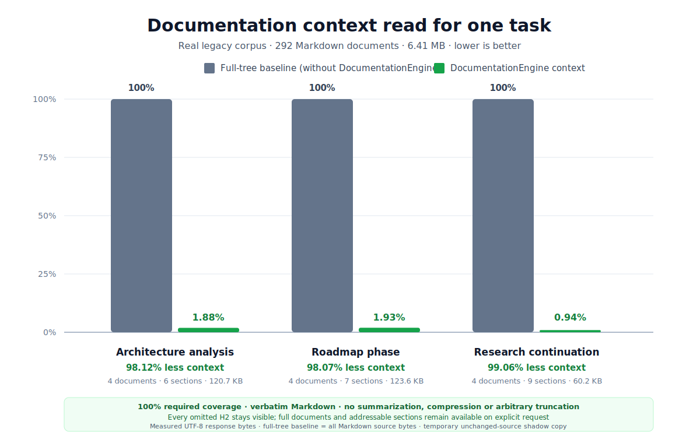

# Context reduction measurement

This measurement answers one narrow question:

> For a predefined documentation task, what share of the complete Markdown
> corpus must be returned to an AI client?

It does not measure total engineering productivity, model reasoning quality,
latency or every possible retrieval strategy.

## No-loss retrieval contract

Context reduction does not mean that DocumentationEngine compresses or
summarizes authored meaning. The measured packets follow these rules:

- navigation excerpts and explicitly selected sections are verbatim Markdown;
- no response is cut to an arbitrary token budget;
- every omitted H2 is named in the packet coverage line;
- the full document or any addressable section remains available through an
  explicit read or context request;
- stale revision declarations and unverifiable generation deltas fail safe by
  returning current content or rejecting the request.

The engine does intentionally select a task-specific semantic neighborhood
instead of returning the entire corpus. That selection is inspectable: the
packet states which documents and sections were included, what was omitted and
why. The quality guard below verifies the required scenario ground truth before
a smaller packet is counted as a successful result.

## Metrics

The measurement uses UTF-8 response bytes because they are deterministic and
provider-neutral:

```text
context share = context packet bytes / full corpus bytes
context reduction = 1 - context share
```

Actual token counts vary by model and tokenizer. The byte measurement is a
stable proxy for context volume, not a token-count promise.

## Baseline

The baseline is a naive full-tree read: every Markdown source byte in the
corpus is supplied for one task. This is intentionally explicit and
conservative. It is not a comparison with manual search, IDE navigation, RAG
products or a human-curated document bundle.

## Corpus

The measured source was a real, historically grown legacy documentation tree:

- 292 Markdown documents;
- 6,409,193 UTF-8 source bytes;
- 104,521 lines;
- 14.5 KB median document size;
- 39 KB 90th-percentile document size;
- 3,402 Markdown links;
- no existing DocumentationEngine stable-ID/revision model.

The source corpus is private and is not distributed with this repository. No
document body, private path or project-specific title is reproduced in the
chart or this guide. The aggregated measurements are sufficient for the
comparison.

## Benchmark-only shadow overlay

The original corpus remained unchanged. A temporary copy received mechanical
benchmark IDs and `revision: 1` metadata so DocumentationEngine could address
the documents. Those IDs are measurement labels, not an adoption proposal.

Three task scenarios and their semantic ground truth were fixed before the
packets were measured:

| Scenario | Required documents | Explicit required sections |
| --- | ---: | ---: |
| Architecture analysis | 4 | 6 |
| Roadmap phase | 4 | 7 |
| Research continuation | 4 | 9 |

Only the scenario targets received benchmark `depends_on` relations. Existing
Markdown links were not converted automatically: a human-navigation link is
not necessarily a semantic dependency, and treating every link as one would
inflate the packet artificially.

Each task used a depth-one Markdown `context` packet plus the predefined
explicit sections. The output was accepted only when:

- the command exited successfully;
- the target and every required dependency were present;
- every explicit required section was present;
- every selected document carried a coverage line;
- omissions remained visible rather than being silently truncated.

This gives 100% coverage of the declared scenario ground truth. It does not
claim that the temporary overlay represents every latent relationship in the
legacy corpus.

## Results



| Scenario | Full corpus | Packet | Context share | Context reduction | Ground-truth coverage |
| --- | ---: | ---: | ---: | ---: | ---: |
| Architecture analysis | 6,409,193 B | 120,702 B | 1.88% | 98.12% | 100% |
| Roadmap phase | 6,409,193 B | 123,570 B | 1.93% | 98.07% | 100% |
| Research continuation | 6,409,193 B | 60,179 B | 0.94% | 99.06% | 100% |

The packet sizes include DocumentationEngine's headings, coverage statements
and diagnostics, plus the benchmark metadata added to the temporary copy. The
full-tree baseline uses the original source bytes, so the comparison does not
hide engine or shadow-overlay overhead.

## Interpreting the graph

The gray bar is always 100% because it represents reading the entire corpus.
The green bar is the measured DocumentationEngine packet for that task. The
percentage callout is the reduction in response bytes, not a claim that every
workflow becomes that much faster or better. The selected material remains
verbatim; the graph measures avoided unrelated or explicitly omitted context,
not textual compression.

The result demonstrates a structural property: unrelated documentation need
not enter a task packet when the semantic neighborhood is explicit. It does
not imply a universal constant packet size. A broader dependency neighborhood
or more requested sections produces a larger packet.

## Why no universal large-corpus forecast is published

For a fixed packet, its percentage of a growing corpus is simple arithmetic.
But real task neighborhoods can grow with the corpus, so projecting one packet
size to arbitrary 1 MB or 10 MB collections would imply an assumption that may
not hold. The measured 6.41 MB legacy corpus already demonstrates large-corpus
behavior without presenting that assumption as a benchmark result.
